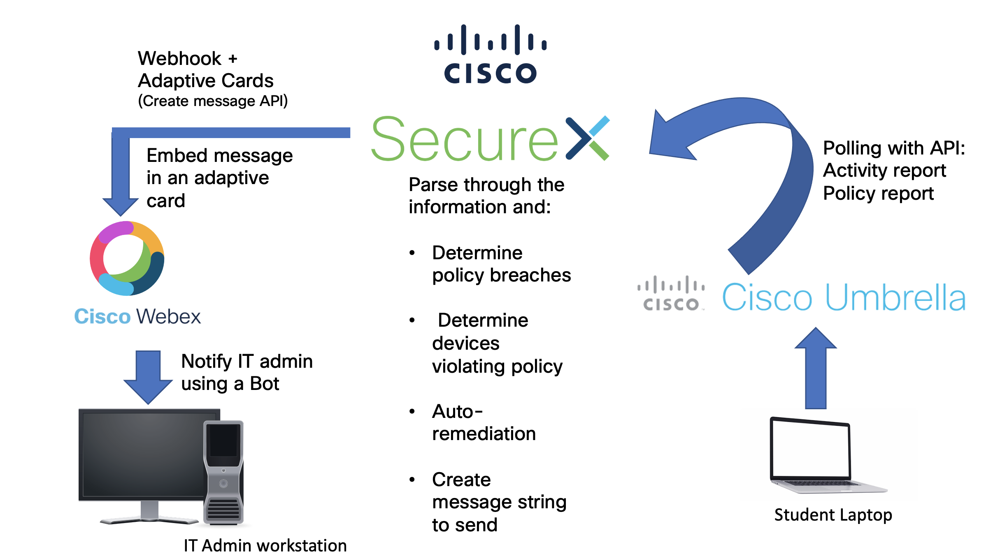
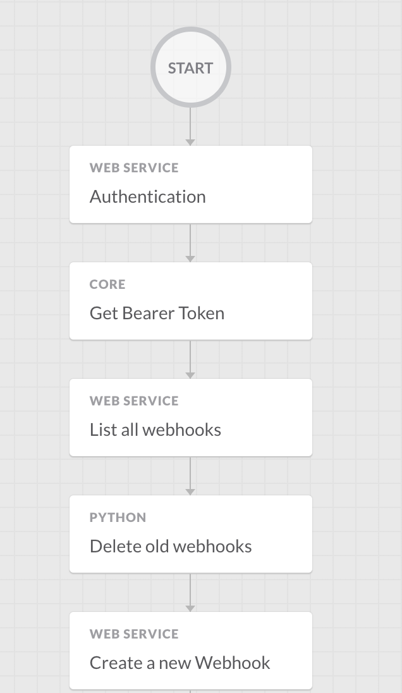

# Umbrella SecureX Automation
This is the Umbrella SecureX source code. Using Umbrella API with SecureX orchestrator, we are able to push out policies, notify, remediate and reassign devices to more restrictive policies.
Along with integration to Webex and with the help of Webex bot, IT admins will be notified of any device violating the policy by accessing certain site/application and also be able to remediate by assigning to other set of restrictive policies.  

The SecureX orchestrator is a powerful tool which enables us to orchestrate the process of using Umbrella to prevent and notify the access of devices according to preset policies.  

### High Level Design


## Contacts

* Hyojin Kim (hyojikim@cisco.com)
* Ozair Saiyad (osaiyad@cisco.com)
* Vasant Srichawla (vsrichaw@cisco.com)
* Josh Ingeniero (jingenie@cisco.com)

## Solution Components
* Cisco SecureX orchestrator
* Cisco Umbrella API’s
* Cisco Umbrella
* Webex bot 

## Installation:

#### Clone the repo
```console
git clone https://www.github.com/gve-sw/GVE_DevNet_Umbrella_SecureX_Block_Alerts.git
```

## Setup:
You can log in to Cisco SecureX and go to Orchestration to use our orchestration.
You can import the Github repo or the project on SecureX Orchestration. 
You would then need to either input your details through the web GUI or edit a config file below.


#### Umbrella details:

The relevant API Keys can be generated by logging into the Umbrella Dashboard, going to the Admin section, and selecting the appropriate key.

The Umbrella API has several sub APIs and endpoints, which you can read more about: https://developer.cisco.com/docs/cloud-security/#!network-devices-overview . These require different authentication tokens, which is why you need to generate a different API Key for all of them.

In our project we used Reporting API key, Management API key, and lastly Network Devices API key, where Umbrella Management API—> Umbrella_Proj, Umbrella Network Device Key—> Umbrella_NetworkDevices, Umbrella Reporting API Key—>Umbrella_Reports.

Furthermore, a WebEx Access token was used for the Bot, which can be generated via https://developer.webex.com/my-apps/umbrella-notification-bot -> Regenerate Access Token.  The access token is saved in the workflow as Bot_AccessToken2. 

```python
RPRTG_KEY = ''
RPRTG_SECRET = ''
NET_KEY = ''
NET_SECRET = ''
ORG_ID = ''
```

## Usage:

### Umbrella dashboard

#### Login


#### Policy Selection


#### Create Policies


#### Roaming computers


### SecureX Orchestrator

#### Login


#### SecureX Dashboard


#### Workflows




### Webex Umbrella notification bot


## Links to Devnet Learning Labs
For more resources on Umbrella API and Webex bot you may refer to the following links:
* [Umbrella](https://developer.cisco.com/learning/modules/umbrella-v11)
* [Webex Bot](https://developer.webex.com/docs/bots)

## License
Provided under Cisco Sample Code License, for details see [LICENSE](./LICENSE.txt)

## Code of Conduct
Our code of conduct is available [here](./CODE_OF_CONDUCT.md)

## Contributing
See our contributing guidelines [here](./CONTRIBUTING.md)
